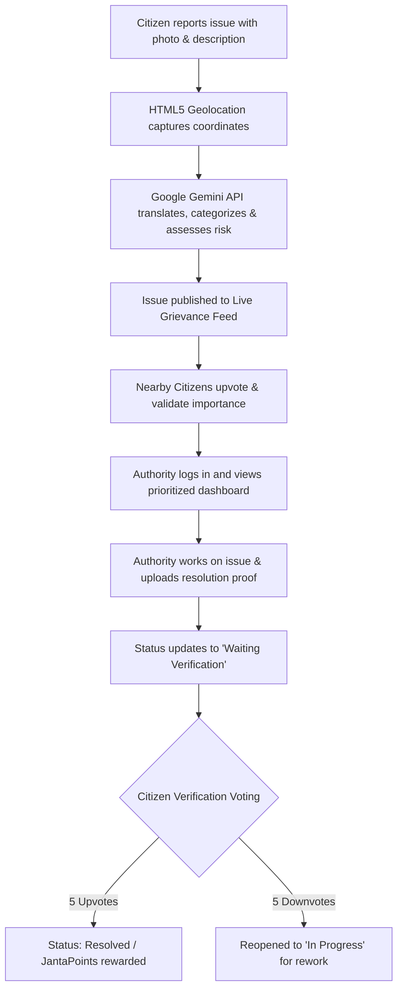

# 🤝 JantaMitra AI — Project Documentation

## 1. Problem Statement Selected

### **Community Hero - Hyperlocal Problem Solver**

Communities frequently face issues such as potholes, water leakages, damaged streetlights, waste management concerns, and public infrastructure challenges. Reporting these issues is often fragmented, difficult to track, and lacks transparency.

---

## 2. Solution Overview

**JantaMitra AI** is a state-of-the-art, AI-powered civic grievance and resolution platform that bridges the communication and action gap between local citizens and municipal authorities. Built to tackle hyperlocal issues head-on, JantaMitra AI transforms citizens from passive observers into active "Community Heroes" by providing them with powerful reporting tools, while introducing strict transparency rules that keep municipal authorities accountable.

### **How the Solution Works**


### **Core Value Propositions**
1. **Language Inclusivity:** Allows citizens to voice concerns in their preferred regional languages (Hindi, Bengali, Tamil, Telugu, Marathi, etc.), utilizing AI to generate English summaries for administrative clarity.
2. **Citizen-Led Prioritization:** Features a voting mechanism (upvotes/downvotes) that bubble up high-priority community safety hazards to the top of the authority's work queue.
3. **Double-Check Accountability:** Prevents contractor negligence by enforcing a strict **Crowdsourced Physical Verification Pipeline** where authorities cannot close a ticket without community consensus.
4. **Civic Incentivization:** Engages users through gamification, rewarding citizens with **JantaPoints** for verified resolutions and showcasing them on local leaderboards.

---

## 3. Key Features

### **👤 Citizen Portal**
* **Raise Local Issues:** Easily submit a complaint by uploading a photo proof, naming the issue, and writing a description in any regional language.
* **HTML5 Location & Reverse Geocoding:** Automatically captures the user's GPS coordinates and reverse-geocodes them (via OpenStreetMap) to auto-fill street names, wards, cities, states, and pincodes.
* **Interactive Grievance Feed:**
  * **Track My Issues:** View real-time status milestones of self-submitted complaints.
  * **Explore Nearby Issues:** Browse issues in the vicinity, check details, and cast upvotes to alert authorities.
* **Gamified Civic Leaderboard:** Displays active local citizens, tracking their cumulative JantaPoints and accepted complaint counts. Users earn points when their reported issues are approved and resolved.

### **🤖 AI-Powered Processing Engine**
* **Multilingual Translation:** Instantly translates local dialects and regional languages into clean, professional English summaries.
* **Semantic Categorization:** Classifies complaints into strict municipal categories (e.g., Road Problems, Garbage Issues, Water Related, Sewage & Drainage, Streetlight Failure, etc.).
* **Risk & Priority Assessment:** Analyzes the semantic urgency of the citizen's description to grade the **Risk Level** (`low`, `moderate`, `high`, `emergency`) and set the **Municipal Priority** (`low`, `medium`, `high`, `critical`) for the official dashboard.

### **👮 Authority Portal**
* **Unified Metrics Dashboard:** Provides high-level visual charts of total reported, active, pending verification, and resolved issues.
* **Upvote-Prioritized Work Queue:** Sorts issues dynamically based on community upvotes, ensuring critical safety issues (like open manholes) receive immediate attention.
* **1-Click Google Maps Navigation:** Generates direct maps redirection links containing the exact latitude and longitude of the issue for on-site maintenance crews.
* **Lifecycle Management:** Allows authorities to accept, reject (with reason notes), mark as in-progress, or submit resolved proofs.

### **🔄 Crowdsourced Citizen Verification Pipeline**
* When an authority completes work, they must upload a **resolution photo proof** and submit a descriptive fix note.
* The issue transitions to `Waiting Verification` status.
* Community members physically inspect the fix and vote:
  * **Confirm Fix (Upvote):** 5 upvotes officially transition the ticket to `Resolved` and trigger citizen point rewards.
  * **Reopen Issue (Downvote):** 5 downvotes automatically flag the ticket as incomplete, returning it to `In Progress` status for rework.

---

## 4. Technologies Used

| Layer | Technology | Purpose |
| :--- | :--- | :--- |
| **Frontend** | React 18 & TypeScript | Component-based, type-safe interactive UI. |
| **Build Tool** | Vite | Ultra-fast development server and bundle packager. |
| **Styling** | TailwindCSS (v4) | Utility-first CSS framework for modern, responsive layouts. |
| **Animations** | Motion (Framer Motion) | Micro-interactions, transitions, and state changes. |
| **Icons** | Lucide React | Sleek, vector-based civic and application icons. |
| **Backend** | Node.js & Express | Lightweight server for REST APIs and routing logic. |
| **Authentication** | SMS OTP Gateway | Verification checks via Twilio SDK / Textbelt API. |
| **Geocoding** | OpenStreetMap Nominatim | High-fidelity coordinate to address reverse lookup. |

---

## 5. Google Technologies Utilized

### **1. Google Gemini API**
JantaMitra AI integrates the official **`@google/genai` Node.js SDK** powered by the state-of-the-art **`gemini-2.5-flash`** model. This serves as the platform's core intelligence module:
* **Natural Language Processing:** Detects local Indian dialects/languages and translates descriptions to standard English for administrative records.
* **Structured Output Schema:** Enforces a rigid JSON Schema using `Type.OBJECT` to guarantee consistent API payloads containing translated descriptions, category classifications, risk assessments, and priority parameters.
* **Urgency Grading:** Semantically checks for immediate life-safety threats (e.g., matching keywords like "open manhole near school" to tag as `emergency` and `critical`).

```typescript
// Core implementation utilizing the new @google/genai SDK
const response = await client.models.generateContent({
  model: "gemini-2.5-flash",
  contents: prompt,
  config: {
    responseMimeType: "application/json",
    responseSchema: {
      type: Type.OBJECT,
      properties: {
        translatedDescription: { type: Type.STRING },
        category: { type: Type.STRING },
        risk: { type: Type.STRING },
        priority: { type: Type.STRING }
      },
      required: ["translatedDescription", "category", "risk", "priority"]
    }
  }
});
```

### **2. Google Firebase (Firestore)**
* **Real-Time Data Sync:** Configured with Google Cloud Firestore via `firebase-admin` to dynamically synchronize grievance records, citizen point logs, verification votes, and leaderboard standings.
* **Resilient Cache Pipeline:** Built with an active local JSON file cache fallback (`database.json`) to serve read requests instantly (<1ms latency) and sync updates to Firestore asynchronously in the background.

### **3. Google Maps Integration**
* **Hyperlocal Navigation:** Integrates captured citizen coordinate pairs (latitude/longitude) with the Google Maps search API query parameters.
* **Authority Dispatching:** Generates absolute, deep-linked URLs (`https://www.google.com/maps/search/?api=1&query=lat,lng`) on each authority ticket card, enabling one-click navigation on mobile/tablet devices for field repair teams.
